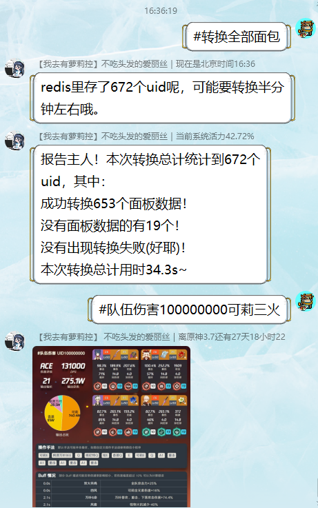
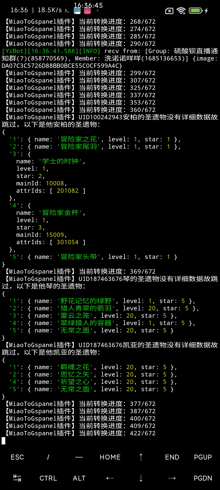
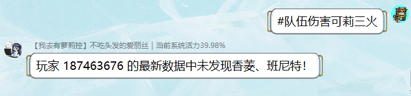
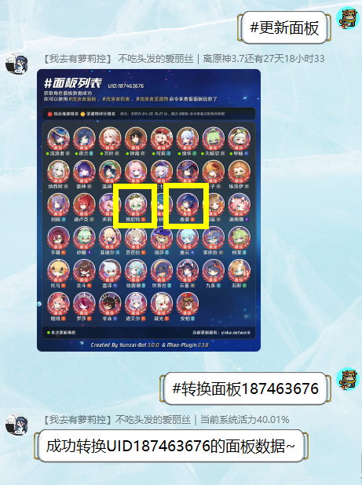
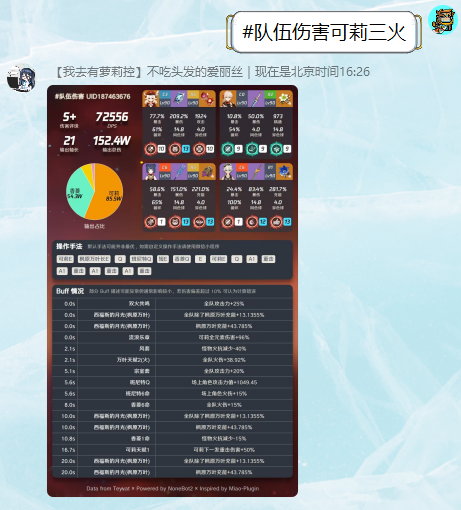
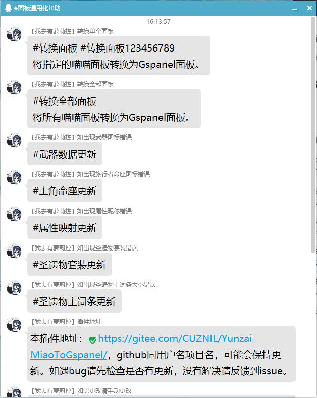

# 云崽Bot面板通用化插件.js

### 介绍
将[喵喵插件](../../../../yoimiya-kokomi/miao-plugin)产生的面板数据适配到[Gspanel](https://github.com/monsterxcn/nonebot-plugin-gspanel)，以便在Gspanel使用。

### 安装教程

请确保你已经正确搭载了[云崽Bot v3](https://gitee.com/yoimiya-kokomi/Yunzai-Bot)、[miao-plugin](../../../../yoimiya-kokomi/miao-plugin)和[nonebot-plugin-gspanel](https://github.com/monsterxcn/nonebot-plugin-gspanel)，尚不清楚其他版本的云崽使用本插件是否会报错。

 **1. 将[`MiaoToGspanel.js`](MiaoToGspanel.js)文件放入`Yunzai-Bot/plugins/example/`文件夹下即可。** 

<details><summary>不知道怎么放？展开看看</summary>

首先进入云崽根目录。

然后输入以下指令：

进入js插件目录
```
cd plugins/example/
```
在此处下载本js插件
```
curl -O https://gitee.com/CUZNIL/Yunzai-MiaoToGspanel/raw/master/MiaoToGspanel.js
```
如遇`curl not found`报错请自己百度怎么处理，一般是你没装curl。

实在是不会的话建议看[这篇教程](../../../Yunzai-install/)，如果curl都不会装的话直接用[时雨脚本](https://trss.me/)摆烂多好。

———————————分割线———————————

</details>

 **2. 手动配置修改js插件内8-11行的内容** 

具体修改逻辑见13-19行的注释，日后会考虑将这一过程整合到插件内。如果你搭配我的[云崽安装教程](../../../Yunzai-install/)来安装gspanel和miao，则不需要更改任何内容。

### 功能演示

<details><summary><b>#转换全部面板</b></summary>



该命令只有BOT主人可用，功能为转换所有面板并从redis获取uid绑定信息适配[gspanel](https://github.com/monsterxcn/nonebot-plugin-gspanel)。后台可以查看转换进度，如下图所示。



———————————分割线———————————
</details>

<details><summary><b>#转换单个面板</b></summary>



我想通过[gspanel](https://github.com/monsterxcn/nonebot-plugin-gspanel)计算UID187463676的可莉三火队伍伤害，但是班尼特香菱都没有放在角色展柜，[gspanel](https://github.com/monsterxcn/nonebot-plugin-gspanel)缓存也没有班香的数据。



这时候如果喵喵插件曾经更新过班香的数据，即可如图所示发送`#转换面板187463676`或`#转换面板`

这时候BOT做了2件事：

0. 如果你的命令没带uid，从redis数据库获取绑定信息。

1. 将你的QQ和uid的绑定信息更新到[gspanel](https://github.com/monsterxcn/nonebot-plugin-gspanel)以便其调用。

2. 将你的[喵喵插件](../../../../yoimiya-kokomi/miao-plugin)面板数据的所有信息转换为[gspanel](https://github.com/monsterxcn/nonebot-plugin-gspanel)可以识别的格式并存储到其缓存目录。（不含圣遗物详情的除外）



如图。如此操作以后，即可调用缓存数据计算队伍伤害了。

———————————分割线———————————
</details>


### 功能列表

发送`#面板通用化帮助`即可获取帮助信息，如下图所示。



# 遇到其他问题/需要联系我/需要使用Bot

群号 **638077675** 

答案  **火花骑士** 


[](http://jq.qq.com/?_wv=1027&k=tqiOtCVc)